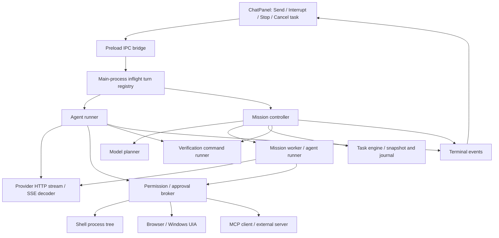

## Verdict

All eight reproduced findings have local repairs and regression coverage. The findings below preserve the original audit evidence at the audited revision, not the current implementation. This does not establish universal stoppability or approve unattended operation with arbitrary external tools.

Restart an already-running Moss instance after rebuilding to load these changes. The user's active instance has not been restarted, and a previously packaged executable is not updated by rebuilding the source workspace.

## Repair Status

| Finding | Repair | Focused evidence |
| --- | --- | --- |
| F1 | Shared shell/verification process runner; Windows tree termination with bounded confirmation and explicit cleanup failure | Real Windows shell abort, verification abort, and verification timeout remove child and grandchild processes |
| F2 | Host-owned automation disposal; abort closes browser contexts and kills UIA bridges; sessions are quarantined; terminal events wait for cleanup | Real Chromium missing-target click settles on Stop; desktop bridge test waits for process closure |
| F3 | Cancel task aborts all matching live turns, releases approval waits, and preserves cancelled state during finalization | IPC cancellation aborts an active provider; controller terminal-state checks prevent accepting cancelled work |
| F4 | Signal-aware approval registration denies requests arriving after cancellation | Real IPC test holds approval persistence, presses Stop, releases persistence, and observes settlement without a second Stop |
| F5 | Task and step deadlines; cumulative token/cost admission; concurrent reservations and divided worker allowances; planning/worker cost accounting | Live worker deadline, concurrency reservation, unknown-price rejection, and overrun-without-tool-execution tests |
| F6 | Generic workspace checks and model review no longer certify arbitrary outcomes; mission checks require explicit host-owned criterion binding | Missing-file criterion fails despite a passing package test; explicitly bound content check passes only after the file exists |
| F7 | Explicit Stop clears queued Interrupt work | UI regression confirms no second turn starts after Interrupt followed by Stop |
| F8 | Maintained SSE parser handles fragmented CR/LF/CRLF and multiline data; bounded event buffering; abort cancels pending reads | Provider adapter tests plus framing, oversized-event, whitespace, and blocked-reader regressions |

The shared implementations are [mission-budget.ts](../electron/backend/moss/task/mission-budget.ts),
[managed-tools.ts](../electron/backend/moss/tools/managed-tools.ts), and
[shell-tool.ts](../electron/backend/moss/tools/shell-tool.ts).

### Behavioral Limits

* Process termination is not rollback: an action completed before Stop cannot be undone by cancellation. Windows termination failure is reported explicitly; external MCP servers and detached services are outside this process ownership boundary.
* Model admission uses a conservative prompt-byte allowance plus output reservations, not a provider-specific exact tokenizer. Missing usage consumes the reservation. Reported overruns remain recorded and prevent subsequent execution, but already billed usage cannot be reversed. Configured rates are estimates, not billing guarantees.
* A cost-limited mission with an unknown model rate now blocks before model access. Configure the model's input/output rates, including explicit zero rates for a genuinely free local model, rather than treating unknown pricing as free.
* `WorkspaceMissionVerifier` accepts checks bound by trusted host code to criterion IDs. The current generic UI workflow does not supply such bindings, so outcome-bearing missions remain blocked as unverified instead of automatically certifying package tests. This is intentional; no phrase-matching verifier or model-authored proof was substituted.
* Desktop bridge cancellation is covered without manipulating a user's real desktop window. Real Windows descendant termination and real headless Chromium cancellation are exercised separately. POSIX process-group termination is implemented but not exercised on this Windows host.
* Dependency installation reported npm security advisories. Broad dependency remediation and cloud evaluation were not part of these reliability repairs.

### Repair Verification

* Final serial deterministic suite: 1,362 passed, zero failed, four skipped. Report: `%TEMP%/moss-harness-fixes-final-20260918.json`.
* Separate chat IPC integration suite: 12 passed, including delayed approval persistence and active-task cancellation.
* Real Windows process-tree tests cover shell Stop, verification Stop, and verification timeout. Real Chromium testing covers cancellation of a pending missing-target click.
* Rebuilt Electron smoke test used a disposable profile and local CRLF SSE provider. The response rendered; Interrupt followed immediately by Stop produced exactly one provider request, no queued restart, and no renderer errors. The fixture server and temporary app profile were removed afterward.
* Backend and renderer typechecking, production build, IDE diagnostics, and tracked whitespace checks passed. The build retained its large-chunk advisory. Markdown metadata and 26 source links validated.

No cloud calls, commits, pushes, active-profile changes, or packaged release replacement were performed for these repairs.

## Scope

Environment: Windows desktop assistant with local filesystem, shell, browser, desktop, provider, and durable mission capabilities. Severity reflects an assistant that can perform real user-authorized actions, not an isolated benchmark.

Original audited revision: `33946cfdc61cb22d82e6023be5b2f0290f4095fc`, plus the preceding uncommitted shell cancellation fix and its two test files. Runtime changes were made afterward at the user's request; see Repair Status. Original finding locations refer to the audited code and may have shifted.

This is an end-to-end execution and reliability audit, not a line-by-line audit of every repository file or a complete security assessment. Full regression execution complements, but does not replace, source review and fault injection.

Read in full: the agent runner, approval broker, shell tool, verifier, verification registry, mission controller, mission worker, mission planner, mission verifier, task engine, task store, browser tools and Playwright driver, desktop tools and Windows UIA bridge, MCP manager, SSE reader, OpenAI-compatible provider, compaction summarizer, Electron main, and preload bridge. Anthropic streaming behavior was reviewed; its model-list tail was not part of the cancellation review.

Read targeted control paths: ChatPanel event handling, launch, Interrupt, Stop, task cancel/resume; chat IPC registration, turn execution, approval persistence, renderer-loss cleanup, task finalization, and learning handoff. Unrelated rendering, settings, attachment handling, and CRUD handlers were not reviewed in full.

## System Map

Execution is user-triggered. Compaction and retries occur inside turns; mission workers can run readonly steps concurrently. Startup recovers active durable tasks and initializes MCP connections. There is no universal cancellation-completion supervisor spanning all operations.

## Stated Purpose and Specification Drift

The UI offers Stop and Cancel, missions advertise bounded duration/tokens/actions/cost, and mission completion claims passing host-owned evidence. These imply stronger guarantees than several implementation paths currently provide:

* Stop sends an abort request but does not consistently stop active operations.
* Cancel task changes durable state but does not cancel its worker.
* Mission budgets are partly post-operation accounting rather than continuously enforced limits.
* Generic workspace checks can be labelled as evidence for an unrelated requested outcome.
* An explicit Stop does not discard an already queued Interrupt follow-up.

## Findings

### F1 High: Verification retains the original Windows stall

Location: [verifier.ts:71](../electron/backend/moss/verify/verifier.ts#L71), [verifier.ts:75](../electron/backend/moss/verify/verifier.ts#L75).

Trigger: a configured verification command starts a child process that inherits stdout/stderr. The user clicks Stop, or the verification deadline expires. Both handlers call `child.kill()` on the shell only; settlement still requires the child's `close` event.

Consequence: the shell exits, its descendant retains the pipes, `runVerify` stays pending, and the runner cannot emit its terminal event. The UI remains busy. This affects post-mutation checks and mission verification, independently of the fixed `run_command` tool.

Evidence: an isolated real Windows command printed its PID and stayed alive. After abort, the verification promise remained unsettled and the descendant PID remained alive. The probe terminated that exact descendant and awaited cleanup.

Recommended action: reuse one process-tree lifecycle implementation for shell tools and verification. Represent abort/timeout distinctly from exit success, impose bounded cleanup, and surface termination failure. Add a real inherited-pipe regression for both Stop and timeout.

### F2 High: Automation operations are outside the cancellation contract

Locations: [browser-tools.ts:209](../electron/backend/moss/browser/browser-tools.ts#L209), [desktop-tools.ts:204](../electron/backend/moss/desktop/desktop-tools.ts#L204), [agent-runner.ts:818](../electron/backend/moss/agent-runner.ts#L818), [chat-ipc.ts:603](../electron/ipc/chat-ipc.ts#L603).

Trigger: a browser click waits for a missing target, or a desktop operation is still active when Stop is pressed. Built-in browser/desktop wrappers do not consume the context's abort signal or declare tool deadlines. Browser driver methods receive no signal. The UIA bridge has a separate 30-second timeout, but no Stop connection.

Consequence: abort reaches the runner but not the active action. The turn remains pending until the driver finishes or fails, and a delayed side effect can still occur. Browser managers have `closeAll`, but the returned tool collection exposes no host cleanup handle; per-turn registries are discarded without a guaranteed browser cleanup pass. An omitted model-driven close can leave a browser process behind.

Evidence: through the real runner and installed Playwright driver, a missing-button click remained pending 150 ms after abort, with the browser still open and no declared tool timeout. Explicit probe cleanup closed the driver and released the turn. Desktop signal omission and missing host finalization were confirmed in source, not by interacting with the user's desktop.

Recommended action: make automation contexts host-owned, abort active operations through driver cancellation or context disposal, enforce operation deadlines, and close resources in turn finalization. Do not substitute an abandoned promise for confirmed cleanup. Expose a cleanup-failed state when termination cannot be established.

### F3 High: Cancel task does not stop the active worker

Locations: [ChatPanel.tsx:913](../src/components/ChatPanel.tsx#L913), [chat-ipc.ts:196](../electron/ipc/chat-ipc.ts#L196), [task-engine.ts:472](../electron/backend/moss/task/task-engine.ts#L472).

Trigger: click Cancel on a task whose worker is still executing. The handler invokes only `taskEngine.cancel`; it does not find and abort the task's inflight controller or deny its approval wait.

Consequence: the task is persisted as cancelled while its worker continues. Ongoing model calls or tool effects can occur after cancellation. If it is waiting for approval, cancelling the task can also prevent approval-state resolution without releasing the broker.

Evidence: a real TaskStore/TaskEngine/MissionController probe paused a harmless worker, cancelled its task, and then released it. The worker signal remained un-aborted, a post-cancel counter increment occurred, and the durable task still said `cancelled`. The IPC handler delegates exactly to this state-only cancellation method.

Recommended action: unify task cancellation with inflight execution cancellation by task ID. Abort workers and settle approval waits, then persist the terminal state with explicit cleanup outcome. Test cancellation while streaming, executing a tool, and waiting for approval.

### F4 High: Stop can miss an approval registered after cancellation

Locations: [chat-ipc.ts:127](../electron/ipc/chat-ipc.ts#L127), [chat-ipc.ts:459](../electron/ipc/chat-ipc.ts#L459), [chat-ipc.ts:541](../electron/ipc/chat-ipc.ts#L541), [approval-broker.ts:17](../electron/backend/moss/approval-broker.ts#L17).

Trigger: Stop arrives while `taskEngine.requestApproval` is persisting, before `broker.request` registers its resolver. The Stop handler sees no pending broker call, attempts to resolve an empty call ID, swallows the resulting error, and denies an empty broker. Persistence subsequently completes and registers a new wait despite the aborted signal.

Consequence: no tool is executed, but the turn has no terminal event and approval remains pending. A second Stop may release it; the first Stop is not reliable.

Evidence: reproduced through the real registered chat IPC handler, real runner, and temporary durable task store, with controlled approval-persistence latency. After one Stop, `terminalEventAfterStop` was false, approval status was pending, and the protected output did not exist. A second abort was used only to clean up the probe.

Recommended action: make approval registration signal-aware or latch broker cancellation so future requests cannot become pending. Coordinate durable approval completion with the already tracked `pendingDurableApproval`. Do not make release of the in-memory wait depend on successful disk persistence.

### F5 High: Mission budget fields do not bound ongoing execution

Locations: [mission-worker.ts:57](../electron/backend/moss/task/mission-worker.ts#L57), [mission-worker.ts:103](../electron/backend/moss/task/mission-worker.ts#L103), [mission-controller.ts:182](../electron/backend/moss/task/mission-controller.ts#L182), [mission-controller.ts:204](../electron/backend/moss/task/mission-controller.ts#L204).

Trigger: planning or a worker exceeds its duration limit; a multi-round worker accumulates input and output tokens beyond its allocation; or a mission relies on its task cost cap.

Consequence: no timer aborts the live planner/worker when its duration expires. The token limit is reused as a per-response output ceiling, not decremented against cumulative input/output usage. Usage is recorded after the worker settles. Worker usage omits estimated cost and planner cost is recorded as zero, so the advertised task cost cap lacks production accounting. A separate daily provider budget is not the same as a mission budget.

Evidence: the production mission worker remained active after 100 ms with a 20 ms allocation and an un-aborted signal. After release, two model rounds recorded 22 tokens against a 10-token allocation, returning worker status `succeeded`. Estimated cost was absent. This probes worker admission; it does not assert that the controller always leaves an over-budget mission completed, since it can pause afterward.

Recommended action: enforce task/step deadlines across planning, streaming, tools, approvals, and verification; account for aggregate usage before admitting another model round; reserve budget for concurrent workers; record model-rate-based cost. Preserve overruns already incurred as evidence rather than hiding them.

### F6 High: Mission evidence is not bound to the requested outcome

Locations: [mission-verifier.ts:23](../electron/backend/moss/task/mission-verifier.ts#L23), [verification-registry.ts:178](../electron/backend/moss/verify/verification-registry.ts#L178).

Trigger: a mission criterion requires a concrete artifact or external outcome, but the workspace contains a passing generic test/build/typecheck script. The verifier attaches those same package commands to every criterion without checking what each criterion requires.

Consequence: unrelated tests become passing evidence for an unmet requirement. The mission controller can use that evidence to accept a worker's success claim and report verified completion. This is an integrity defect, not a cancellation issue.

Evidence: the real WorkspaceMissionVerifier returned `passed: true` for `requested.txt exists and contains READY` while that file did not exist. The only evidence was `Command passed: npm run test` from a disposable package whose test exited zero.

Recommended action: require criterion-specific, host-owned checks or trusted receipts. Keep generic workspace health checks separate from outcome evidence. If no check can establish the requested outcome, report it as unverified instead of promoting unrelated evidence.

### F7 Medium: Stop does not discard a queued Interrupt

Locations: [ChatPanel.tsx:720](../src/components/ChatPanel.tsx#L720), [ChatPanel.tsx:889](../src/components/ChatPanel.tsx#L889), [ChatPanel.tsx:976](../src/components/ChatPanel.tsx#L976).

Trigger: submit additional context using Interrupt and then press Stop before the old turn's terminal event is handled.

Consequence: Stop aborts the old turn but leaves `queuedInterruptionRef` intact. Its terminal handler immediately launches the queued follow-up, so the assistant starts new work after an explicit Stop.

Evidence: reproduced in a real current-build Electron window with a disposable profile and local streaming fixture. Interrupt followed by Stop produced a second provider request and visible second response. A subsequent ordinary Stop returned to idle with zero renderer errors. No cloud model or user profile was involved.

Recommended action: distinguish interrupt-with-follow-up from explicit stop-and-discard. Explicit Stop must clear the queue before aborting; retain the queued draft only if that behavior is made explicit. Add the combined sequence to the renderer regression suite.

### F8 Medium: Valid CRLF SSE framing produces no events

Location: [sse.ts:21](../electron/backend/moss/providers/sse.ts#L21).

Trigger: a compatible provider or proxy emits standard CRLF event separators. The shared decoder only searches for LF-LF, which is not present in CRLF-CRLF.

Consequence: text, usage, and tool events remain buffered. A closed stream looks empty and triggers recovery; an open stream can appear stalled despite receiving data. This affects both provider adapters using the shared decoder. It does not prove that the user's current provider emits CRLF.

Evidence: identical in-memory streams yielded two events with LF separators and zero with CRLF separators. Both contained one JSON event and a completion marker.

Recommended action: use an SSE parser handling LF, CRLF, CR, and chunk boundaries, with explicit buffer limits. Test equivalent wire payloads under each framing and fragmented delivery.

## Dependencies and Coupling

* Critical: the Electron main event loop and inflight registry. A pending operation prevents terminal delivery; the renderer waits for that event before clearing busy state. Mitigation is partial: signals exist, but there is no common cleanup acknowledgement or escalation state.
* Critical: operating-system process ownership. Shell descendants and verification children can outlive their parent; inherited pipes prevent close; verification remains pending. The shell-tool fix is partial system coverage, not a shared process supervisor.
* Critical: provider HTTP streams and shared SSE decoding. Both provider adapters pass abort to fetch, and a real local stream stopped successfully. Shared framing failure affects both providers. No separate ordinary-chat wall-clock/idle deadline was found in the reviewed runner path.
* Critical: durable task persistence and approval registration. Disk latency opens the Stop race; state cancellation is separate from execution cancellation. Journaling, per-task serialization, and restart recovery provide useful persistence safeguards but do not settle an active in-memory wait.
* Critical when enabled: browser/UIA drivers and MCP servers. Browser and desktop wrappers lack signal propagation. MCP adapters do forward a signal; remote cleanup and actual server-side cancellation were not established by this audit. Shared cooperative waiting means one non-settling operation can block finalization.
* Critical for trust in completion: evidence-to-criterion mapping. A command can run correctly while proving the wrong property, causing silent false verification downstream.

## Instrumentation Gaps

* The UI has no Stop acknowledgement distinguishing cancellation requested, execution stopped, and cleanup failed. A user only sees completion if the active await unwinds.
* Process-tree termination failures in the prior fix are console warnings rather than a surfaced cleanup failure. Immediate tool settlement must not be interpreted as a confirmed exit of all descendants.
* Approval resolution errors are swallowed in IPC. A missing or mismatched pending call produces no direct diagnostic for the stranded user.
* Task cost can stay zero while model work occurs; duration/token overruns are recognized too late to enforce the advertised bounds.
* Passing generic checks are labelled as outcome evidence, so false verification can remain silent without an independent artifact/receipt check.

## Verification Performed

* Full deterministic suite: 1,336 passed, zero failed, four skipped. Command: `npm run test:deterministic -- --maxWorkers=1 --minWorkers=1 --reporter=json --outputFile=<temporary-report>`. The temporary JSON report is named `moss-harness-audit-20260918.json` under the Windows temporary directory.
* Separate IPC end-to-end suite excluded by that command: 10 passed, zero failed.
* IDE diagnostics: no errors reported.
* Prior shell repair: four unit tests plus one real Windows descendant-termination test; included in the full suite above. The prior turn also passed typecheck and backend build.
* Isolated fault-injection probes reproduced F1, F2, F3, F4, F5, F6, F7, and F8. F1 used real Windows processes, F2 used installed Playwright, F4 used actual IPC registration with controlled persistence delay, and F7 used a real Electron UI. Other probes used production modules with scripted dependencies and temporary storage.
* Positive control: ordinary model-stream Stop returned the live test UI to idle with no renderer errors. The audit is not claiming that every Stop fails.

Audit-created browser contexts, servers, processes, profiles, and task fixtures were closed or removed by their probe cleanup. No cloud calls, native user-desktop actions, package installation, production settings changes, or edits to historical evaluation reports were performed.

## What Was Not Audited

* Every individual tool, permission classification, filesystem attack path, secret-management path, and dependency source. This is not security sign-off.
* Cloud provider reliability, billing accuracy against actual invoices, real MCP server termination, and cancellation of an already committed external side effect.
* Live Windows UIA mutations, microphone/dictation, destructive operations, and container isolation. Four gated tests remained skipped; historical sandbox results are not a new sandbox audit.
* The installed release executable was not rebuilt or tested here. The live UI probe used the current compiled development backend and existing renderer bundle, with a disposable profile.
* Unrelated UI sections, all persistence stores beyond the task store, the full evaluation/governance pipeline, and performance at large journal sizes. Scope is the interactive execution path and its mission completion boundary.

## Recommended Hardening Order

1. Make human cancellation authoritative: connect task Cancel to the active controllers, close the approval-registration race, and clear queued Interrupt work on explicit Stop (F3, F4, F7).
2. Centralize process/automation ownership and bounded cleanup; migrate verification to the repaired lifecycle and surface cleanup failure (F1, F2).
3. Enforce live task/step budgets and account for concurrent usage and cost (F5).
4. Bind completion to outcome-specific evidence before claiming verified success (F6).
5. Correct SSE framing and add fragmented-stream cases (F8).
6. Add adversarial end-to-end tests at the boundaries above, including Stop during approval persistence, active automation, verification, and queued follow-up. Test that work stopped, not merely that an abort message was sent.

Do not treat a `Promise.race` timeout alone as containment: the losing operation may continue mutating. Termination, resource disposal, or explicit quarantine must accompany any forced return.

## Audit Confidence

High for the reproduced Windows execution/control-path findings. Medium for the overall harness because the audit is intentionally bounded and does not validate every integration, every tool, or remote cleanup. Passing existing tests does not overturn the fault-injection results.

## Oracle System Evolution

DRIFT: Local process-tree success did not imply a system-wide cancellation guarantee; audit boundaries followed the actual awaited operations.

GAP: A signal reaching a component can be mistaken for completed cancellation, and generic passing evidence can be mistaken for outcome proof.

PATCH: Require observed cleanup and outcome-specific evidence before claiming stopped or verified.